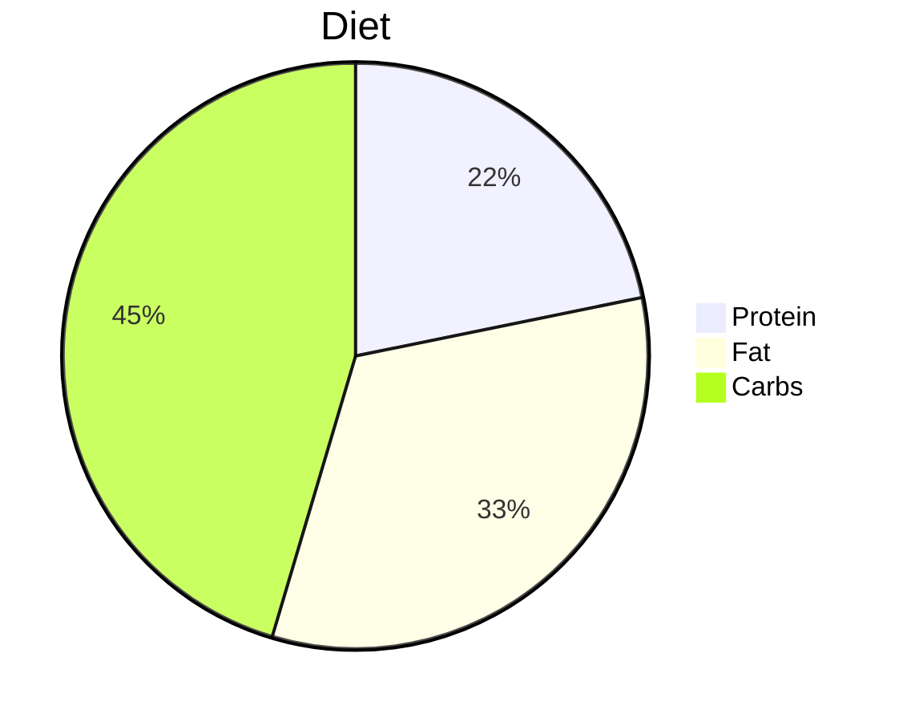

## 热量表

|     | 性别 | 体重 | 身高 | 年龄 | 运动系数 | 基础代谢 | 总消耗 | 摄入 |
| --- | ---- | ---- | ---- | ---- | -------- | -------- | ------ | ---- |
|     |      |      |      |      |          |          |        |      |
<!-- TBLFM: @2$7..@>$7=(((($3*10)+($4*6.25))-($5*5))+if($2<1, 5, -161));%.1f -->
<!-- TBLFM: @2$8..@>$8=($6*$7);%.1f -->
<!-- TBLFM: @2$9..@>$9=($8*0.85);%.1f -->
```button  
name Calculate!  
type command  
action Advanced Tables: Evaluate table formulas  
```
## 计算三大营养素

|     | 体重 | 目标摄入 | 蛋白倍数 | 蛋白质(g) | %   | 脂肪倍数 | 脂肪(g) | %   | 碳水(g) | %   |
| --- | ---- | -------- | -------- | --------- | --- | -------- | ------- | --- | ------- | --- |
|     |      |          |          |           |     |          |         |     |         |     |
<!-- TBLFM: @2$5..@>$5=($2*$4);%.1f -->
<!-- TBLFM: @2$8..@>$8=($2*$7);%.1f -->
<!-- TBLFM: @2$10..@>$10=(($3-(($5*4)+($7*9)))/4);%.1f -->
<!-- TBLFM: @2$6..@>$6=((($5*4)/$3)*100);%.1f -->
<!-- TBLFM: @2$9..@>$9=((($8*9)/$3)*100);%.1f -->
<!-- TBLFM: @2$11..@>$11=(100-($6+$9));%.1f -->
```button  
name Calculate!  
type command  
action Advanced Tables: Evaluate table formulas  
```

### pie chart


